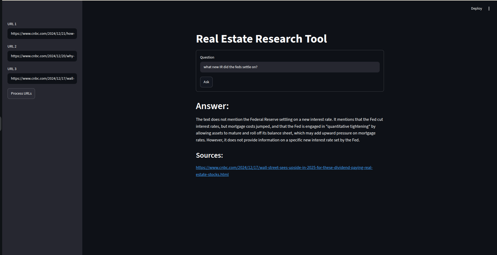

# 🏙️ RealEstate Research Tool

An end-to-end Retrieval-Augmented Generation (RAG) application that scrapes real estate news articles, indexes them into a vector space, and provides grounded answers with clickable source citations. 

Live Demo on Streamlit Cloud: https://harrisonwarega-real-estate-assistant-main-jg4n8z.streamlit.app/

## Tech Stack

* **Orchestration**: LangChain (RetrievalQA pipeline)
* **Vector Storage**: ChromaDB (L2 Euclidean distance matching)
* **Embeddings Model**: HuggingFace (`sentence-transformers/all-MiniLM-L6-v2`)
* **LLM Generation**: Groq Engine (`Llama-3.3-70b-versatile`)
* **Web Scraping**: Native Python `urllib` + BeautifulSoup (`bs4`)
* **User Interface**: Streamlit Cloud Framework



## Core Features

* **Anti-Bot Scraping**: Uses native web request headers to safely bypass cloud datacenter scraping restrictions.
* **Smart Text Chunking**: Implements `RecursiveCharacterTextSplitter` with context overlap to maintain document meaning.
* **MMR Retrieval**: Employs Maximal Marginal Relevance search inside ChromaDB to eliminate redundant data.
* **Grounded Answers**: Context is passed directly to Llama-3.3 to guarantee factual, hallucination-free output.
* **Automated Citations**: Extracts and displays clean, unique source links for every generated response.

## System Architecture

```text
       Target URLs
            │
            ▼
   urllib + BeautifulSoup (Clean Text Extraction)
            │
            ▼
   Recursive Text Splitter (Chunks + Overlap)
            │
            ▼
   HuggingFace Embeddings (Vector Generation)
            │
            ▼
   Chroma Vector Database (Persistent Indexing)
            │
            ▼
   MMR Retriever ---> Groq LLM (Llama 3.3 Context Prompt)
                                    │
                                    ▼
                             Answer + Sources
```

## Local Installation & Setup

1. **Clone the repository:**
   ```bash
   git clone https://github.com
   cd real-estate-assistant
   ```

2. **Install all required dependencies:**
   ```bash
   pip install -r requirements.txt
   ```

3. **Configure your environment keys:**
   Create a `.env` file in the root directory and add your credentials:
   ```text
   GROQ_API_KEY=your_actual_groq_api_key_here
   ```

4. **Launch the web application locally:**
   ```bash
   streamlit run main.py
   ```

## Production Testing Guide

The system has been heavily verified using premium real estate news segments. To test the pipeline end-to-end:

1. Input these live production links into the sidebar fields:
   * `https://www.cnbc.com/2024/12/21/how-the-federal-reserves-rate-policy-affects-mortgages.html`
   * `https://www.cnbc.com/2024/12/20/why-mortgage-rates-jumped-despite-fed-interest-rate-cut.html`
2. Click **Process URLs** and wait for the "Ready!" status.
3. Ask specific contextual questions like: *"What was the 30-year fixed mortgage rate along with the mentioned date?"*

---
## License
This project is open-source and available under the **MIT License**.

